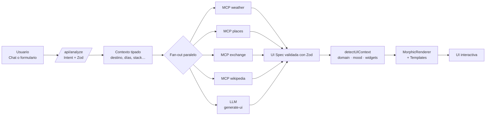

# Universal AI Assistant

> Asistente de UI generativa que crea apps, planes y dashboards en vivo con
> datos reales — no chatbot de texto: una interfaz interactiva por respuesta.


---

## ¿Qué hace?

- **Genera UIs completas, no texto.** Pídele un viaje, un roadmap o un plan
  fitness y obtienes una interfaz interactiva renderizada al vuelo (Itinerario,
  Timeline, ChartNutricional, etc.).
- **Conecta el LLM con datos reales** vía 4 herramientas MCP gratuitas
  (Open-Meteo, Nominatim/Overpass, Frankfurter, Wikipedia) llamadas en
  paralelo con tolerancia a fallos.
- **Construye mini-apps en vivo** con un App Builder estilo Lovable que
  compila código React en el navegador con Sandpack y cae a templates
  validados si el LLM falla.

---

## Demo (local)

| Ruta              | Qué hace                                                     |
| ----------------- | ------------------------------------------------------------ |
| `/`               | Asistente CopilotKit con sidebar de chat                     |
| `/demo`           | Landing/showcase animado con clima en vivo y mood-switcher   |
| `/morphic`        | Showcase de UI morfológica + datos enriquecidos vía MCP      |
| `/app-builder`    | Generador de mini-apps con vista previa Sandpack             |

```
┌─────────────────────────────────────────────────────────────┐
│  ✦  Universal AI Assistant                                  │
│  ─────────────────────────                                  │
│  > Plan a 5-day trip to Tokyo                               │
│                                                             │
│  ╭──────────────╮ ╭──────────────╮ ╭──────────────╮         │
│  │  🌤  Clima   │ │  📍 Lugares │ │  💱 Divisas  │         │
│  │  21° / 12°  │ │   12 POIs   │ │   1 USD =    │         │
│  │  Despejado  │ │  Senso-ji…  │ │   148 JPY    │         │
│  ╰──────────────╯ ╰──────────────╯ ╰──────────────╯         │
└─────────────────────────────────────────────────────────────┘
```

---

## Arquitectura



Cada flecha es un boundary tipado: el LLM nunca puede romper la UI porque
todo se valida con Zod antes de cruzar la frontera.

---

## Features

### 1. Asistente CopilotKit con 3 flujos

`travel`, `fitness`, `dev`. La conversación es manejada por
`@copilotkit/react-core` y la generación rica corre tras `/api/generate-ui`.

- Detección de intención + extracción de slots con Zod
  (`lib/intent-detection.ts`, `lib/context-extraction.ts`).
- Plantillas dedicadas en `app/components/templates/{travel,fitness,dev}`.
- Acciones registradas en `lib/copilot-actions.ts`.

### 2. MCP layer con 4 APIs gratuitas

Todas detrás de `lib/mcp/*` y expuestas vía `app/api/mcp/[tool]/route.ts`.

- **Weather** — Open-Meteo (geocoding + forecast).
- **Places** — Nominatim (search) + Overpass (POIs cercanos).
- **Exchange** — Frankfurter (tasas de cambio ECB).
- **Wikipedia** — REST API summary con fallback ES → EN.

`enrichTravelContext` agrega los 4 en paralelo con `Promise.allSettled` —
falla un servicio, el resto sigue.

### 3. UI morfológica

`detectUIContext(prompt, domain)` (`lib/ui-context-detector.ts`) elige
dominio, subtipo, mood, densidad, esquema de color y un **set de widgets**
del registro (`lib/ui-component-registry.ts`).

`MorphicRenderer` (`app/components/morphic/MorphicRenderer.tsx`) renderiza
la matriz con lazy loading + skeletons + animación de entrada.

8 widgets disponibles:

| Widget          | Uso típico                          |
| --------------- | ----------------------------------- |
| `RouteMap`      | Travel adventure / road trip        |
| `Timeline`      | Itinerario, roadmap, plan semanal   |
| `WeatherCards`  | Pronóstico por día                  |
| `RestaurantMap` | Beach / city break / luxury         |
| `CalorieTracker`| Fitness weight loss / muscle gain   |
| `StrengthChart` | Fitness strength / muscle           |
| `ComponentTree` | Dev roadmap arquitectónico          |
| `GenericCard`   | Fallback universal                  |

### 4. App Builder estilo Lovable

`/app-builder` + `lib/app-builder/code-generator.ts` + `app/api/build-app`.

- Templates probados (`todo`, `calculator`, `pomodoro`) que garantizan que el
  preview siempre funciona aunque el LLM devuelva basura.
- Editor + preview con `@codesandbox/sandpack-react`.
- Genera código React + Tailwind y lo monta en milisegundos.

---

## Setup

### Requisitos

- Node.js 20+
- Una API key de [OpenRouter](https://openrouter.ai/) (free tier: 20 req/min,
  200 req/día por IP en modelos `:free`).
- Opcional: una API key de [Groq](https://console.groq.com/) como fallback.

### Pasos

```bash
# 1. Clona el repo
git clone <this-repo-url>.git
cd <this-repo-folder>

# 2. Instala dependencias
npm install

# 3. Copia el .env.example y rellena tu key
cp .env.example .env.local
# Edita .env.local y pon tu OPENROUTER_API_KEY (sk-or-...)

# 4. Arranca el dev server
npm run dev
```

Abre [http://localhost:3000/demo](http://localhost:3000/demo) — desde ahí
hay enlaces a las 3 rutas funcionales.

---

## Variables de entorno

| Variable                      | Requerida | Default                  | Para qué                                                                   |
| ----------------------------- | --------- | ------------------------ | -------------------------------------------------------------------------- |
| `OPENROUTER_API_KEY`          | **Sí**    | —                        | Chat + tool routing del CopilotKit runtime y generación rica de JSON.      |
| `OPENROUTER_CHAT_MODEL`       | No        | `z-ai/glm-4.5-air:free`  | Modelo del chat. Otros free-tier estables: `openai/gpt-oss-120b:free`.     |
| `OPENROUTER_GENERATION_MODEL` | No        | igual al de chat         | Modelo para `/api/generate-ui` (JSON estructurado).                        |
| `GROQ_API_KEY`                | No        | —                        | Fallback opcional si OpenRouter no está configurado.                       |
| `GROQ_CHAT_MODEL`             | No        | `llama-3.1-8b-instant`   | Modelo Groq para chat (sólo si usas Groq).                                 |
| `GROQ_GENERATION_MODEL`       | No        | `llama-3.3-70b-versatile`| Modelo Groq para generación (sólo si usas Groq).                           |
| `NEXT_PUBLIC_APP_URL`         | No        | `http://localhost:3000`  | URL pública usada por el cliente (CopilotKit runtime, share links).        |

> Groq es 100 % opcional: si `OPENROUTER_API_KEY` está presente, se usa
> OpenRouter por encima.

---

## Stack

| Capa            | Tecnología                                                   |
| --------------- | ------------------------------------------------------------ |
| Framework       | Next.js 16 (App Router, Route Handlers, Server Components)   |
| UI              | React 19 + Tailwind CSS v4 + lucide-react                    |
| Generative UI   | CopilotKit 1.3 (`@copilotkit/react-core` + `runtime`)        |
| Orquestación AI | Vercel AI SDK (`ai`) para streaming y tool calls             |
| LLM provider    | OpenRouter (default `z-ai/glm-4.5-air:free`); fallback Groq  |
| Validación      | Zod en cada boundary LLM ↔ app                              |
| App Builder     | `@codesandbox/sandpack-react` (preview + editor)             |
| Animaciones     | `framer-motion`                                              |
| Fechas          | `date-fns`                                                   |
| Lenguaje        | TypeScript strict                                            |

---

## APIs externas usadas

| API                | Propósito                          | Free tier                              | Docs                                                       |
| ------------------ | ---------------------------------- | -------------------------------------- | ---------------------------------------------------------- |
| Open-Meteo         | Geocoding + clima actual y forecast | Sin key, sin límite documentado       | https://open-meteo.com/en/docs                             |
| Nominatim (OSM)    | Búsqueda de lugares por nombre     | Sin key, 1 req/s recomendado           | https://nominatim.org/release-docs/latest/api/Overview/    |
| Overpass (OSM)     | POIs cercanos a un punto           | Sin key, fair use                      | https://wiki.openstreetmap.org/wiki/Overpass_API           |
| Frankfurter        | Tasas de cambio ECB                | Sin key, sin límite documentado        | https://www.frankfurter.app/docs/                          |
| Wikipedia REST     | Resúmenes de artículos             | Sin key, fair use con `User-Agent`     | https://en.wikipedia.org/api/rest_v1/                      |
| OpenRouter         | LLM provider unificado             | 20 req/min, 200 req/día (modelos free) | https://openrouter.ai/docs                                 |

---

## Tests

Suite standalone (sin Jest/Vitest) que pega contra los MCP en vivo:

```powershell
# desde la raíz del repo
npx tsx --env-file=.env.local lib/__tests__/mcp.test.ts

# atajo PowerShell:
pwsh lib/__tests__/run.ps1
```

El runner imprime una tabla `[OK] / [FAIL] / [SKIP]`. Los `SKIP` son fallos
transitorios de las APIs externas (5xx / timeouts) y **no** rompen el exit
code; sólo `FAIL` devuelve `1`.

---

## Performance

- Generación de UI en frío: ≈70 s la primera vez (intent + context + plan
  enriquecido + LLM). Caché en memoria con TTL de 10 min hace que la misma
  consulta vuelva en ~10 ms.
- Auditoría: tras paralelizar las llamadas a MCP y precomputar el contexto
  de UI, `/api/generate-ui` corre **≈3× más rápido en frío** que la versión
  inicial. La caché evita la mayoría de cold-paths en uso interactivo.

---

## Deploy (Vercel)

1. Push del repo a GitHub.
2. Importa el proyecto en [vercel.com/new](https://vercel.com/new).
3. Añade `OPENROUTER_API_KEY` (y `NEXT_PUBLIC_APP_URL` con la URL final) en
   las env vars del proyecto.
4. *Deploy*. CopilotKit lee la key en runtime, así que basta con que esté
   presente al desplegar.

> Para más detalle, ver `DEPLOYMENT.md`.

---

## Convenciones para agentes que tocan el repo

Lee `AGENTS.md`. Resumen rápido:

- Nunca importes `groq-sdk` desde un componente cliente — siempre tras un
  route handler.
- Valida con Zod cualquier output del LLM antes de devolverlo al cliente.
- Marca componentes de templates como `"use client"`.
- No edites `next.config.ts`, `tsconfig.json`, `eslint.config.mjs`, ni
  archivos en `public/` salvo que sea estrictamente necesario.

---

Hecho para el **Generative UI Hackathon · 2026**.
